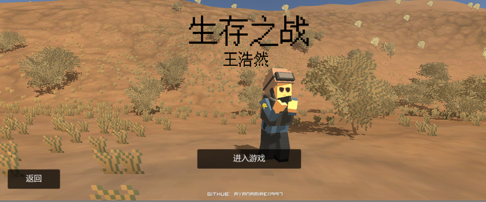
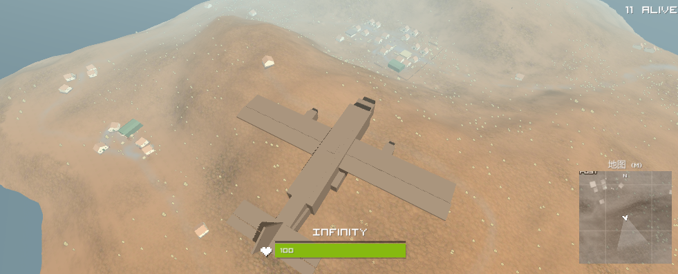
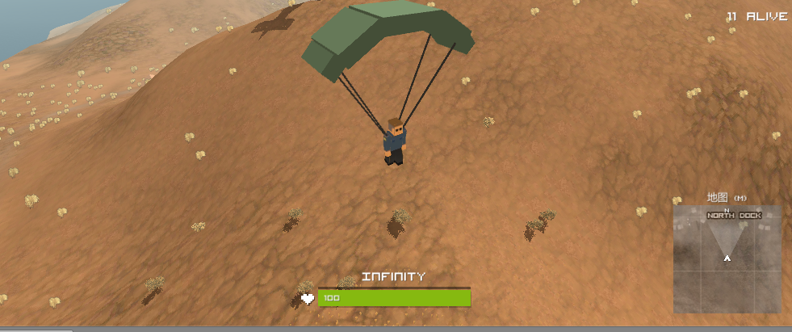
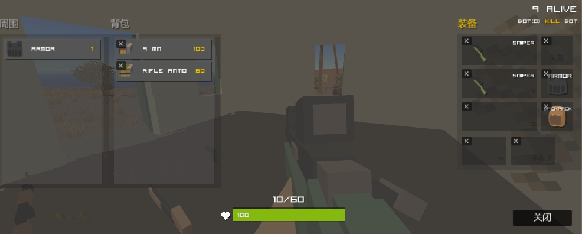
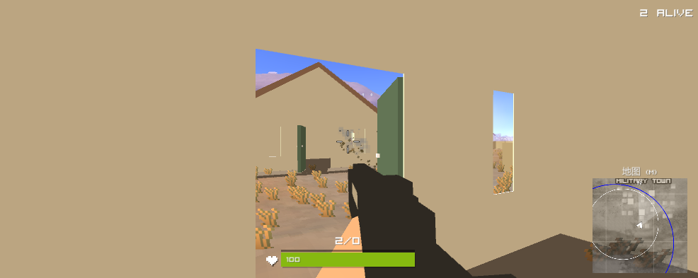
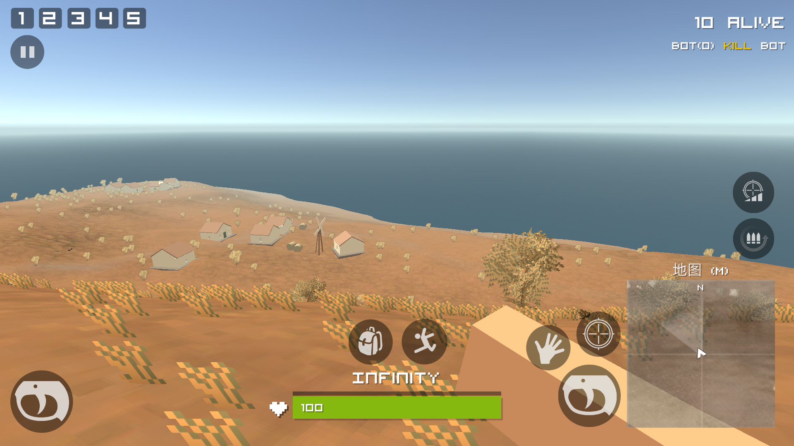
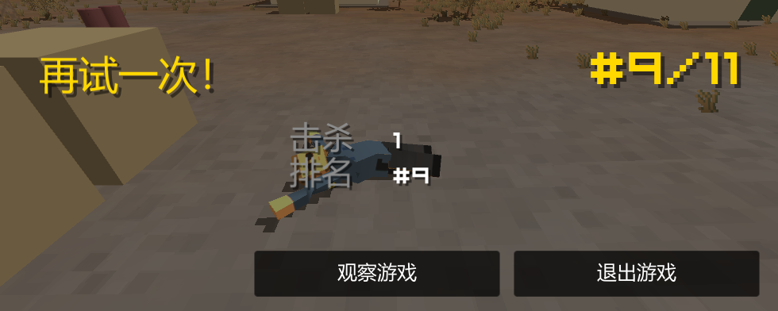
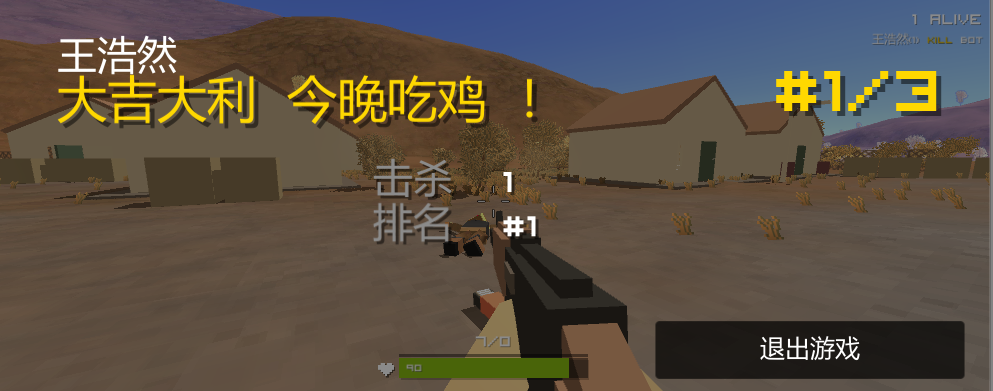

---
# Pixel PUBG
-------------

> A Pixel PUBG game built with unity2018.  
> You can download at https://github.com/ayanamirei1997/Pixel-PUBG/releases

## Feature  
- start a PUBG game
---

## Demo  









---

## Usage

``` 
git clone https://github.com/ayanamirei1997/Pixel-PUBG
run it in unity2018 or VS2017.
```
---
## TODO
- add craft function
- aim to build a sandbox game

---
## License
MIT Licensee

----
----
----
# 整体架构 
- 代表脚本，否则代表游戏物体。


# 1、GameManeger 游戏管理  
- UnitZManager   
  实现游戏逻辑、角色管理、物品管理、物品合成管理、玩家管理、玩家存储、关卡管理、显示器管理、专用服务器管理。
- GameManger  
  管理游戏模式，实现预加载、开始游戏、结束游戏、重新开始、更换场景。
- PlayerManager  
  玩家管理，初始化玩家，管理玩家生存->死亡->观战->重新开始。
- PlayerSave  
  玩家注册、玩家存储、服务器与本地互相存取数据。
- LevelManager  
  进行场景的管理与转换。
- Character  
  选择角色->存储角色。
- AIManager  
  AI管理，优化每个AI对象的FindGameObjectsWithTag函数的调用，判断玩家是否在周围。
- PlayerHUDCanvas  
  玩家显示面板，控制各种UI，如背包、血条、地图等。
- PlayerInputController  
  玩家输入控制、移动、交互、瞄准、改变视角、打开背包/地图。  

## 1.1、GameHUD 游戏显示面板
- TooltipsManager  
  工具提示管理。
- ToggleManager  
  已装备物品，显示在人物身上。
### 1.1.1、Inventory 背包面板
- Panel Instance
  实例化面板。
#### 1.1.1.1、BG 背景图
#### 1.1.1.2、PlayerEquipped 玩家已装备物品
##### 1.1.1.2.1、EquipGun 已装备枪  
- GUIItemEquipped  
  已装备物品GUI控制，装备/切换，扔回面板/背包。
- DragEquipped  
  拖动已装备物品。
- GUIItemCollector  
  记录元素，更新信息
#### 1.1.1.3、PlayerBackpack 玩家可用物品
- GUIPlayerItemLoader  
  玩家物品GUI加载
#### 1.1.1.4、ItemOnGround 附近物品
- GUIItemGroundLoader  
  加载玩家周围物品GUI
#### 1.1.1.5、Button(close) 关闭面板  

### 1.1.2、Map 地图
- MiniMap  
  模拟地图，世界坐标->地图
#### MiniMap 迷你地图
#### Button 地图缩放


### 1.1.3、PlayerHUD 玩家界面
#### KillBadgeManager 击杀显示  
- GUIKillBadgeManager  
  显示击杀提示。
#### Scope 准星
#### MiniMap 地图
#### HPBar HP血条
- ValueBar  
  数值条
#### PillBar 饮品条
#### ActiveInfo 物品交互提示
#### GunInfo 枪械信息（子弹）
#### Alive 存活人数
#### KillFeed 击杀提示  

### 1.1.4、MobileController 手机控制

## 1.2、SystemHUD 系统显示面板
### 1.2.1、Lose 失败
### 1.2.2、Win 成功
### 1.2.3、InGameMenu 游戏中界面（退出游戏、回到游戏）  
### 1.2.4、PopProcess 加载界面
### 1.2.5、EventSystem 事件系统（信息传递、输入输出）
---
# 2、Main MenuCanvas 主面板  
# 3、CharacterPreviewSpot 角色预览
# 4、BattleGroundTerrain  战场地形 
- WindSwing 风速
# 5、Main Camera 主摄像机
- Camera Swing 摄像机摇晃
---
# 6、EventSystem 事件系统（处理输入、射线投射以及发送事件）
# 7、Directional lght 光照  
